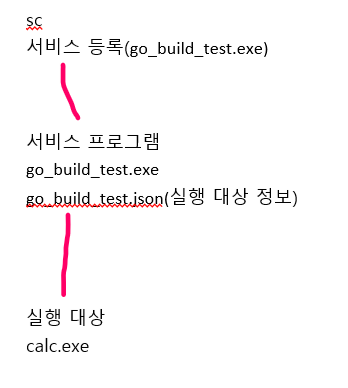

## 프로그램 설명



다른 프로그램을 서비스에 등록하여 사용하게 해주는 프로그램이다.

<br>

## 사용방법

1. json 파일 수정
```
{
{
  "Name": "Antigravity-Agent-Service",
  "DisplayName": "Antigravity-Agent-Service",
  "Description": "Run the Go Builder",

  "Dir": "C:\\Program Files\\Anti-Gravity\\bin",
  "Exec": "C:\\Program Files\\Anti-Gravity\\bin\\Antigravity-Agent.exe",
  "Args": [""],
  "Env": [
    "PATH=C:\\TDM-GCC-64\\bin;C:\\Program Files (x86)\\Git\\cmd",
    "GOROOT_BOOTSTRAP=C:\\dev\\go_ready",
    "HOMEDRIVE=C:",
    "HOMEPATH=\\Documents and Settings\\Administrator"
  ],

  "Stderr": "C:\\builder_err.log",
  "Stdout": "C:\\builder_out.log"
}
}
```

2. 서비스 프로그램 서비스 등록

``` 
sc create "서비스 이름" binPath= "해당 서비스 프로그램 절대 경로" start= auto
```

3. 서비스 실행

```
 sc start "서비스 이름"
```

※ sc 프로그램을 사용하는 과정은 CMD 또는 Powershell 관리자 권한 하에서 수행한다.
※ 서비스 프로그램 명과 json 파일의 명이 같아야 한다.


<br>


## 참고. start 유형

```
boot(부트) - Specifies a device driver that is loaded by the boot loader
부트로더가 로드하는 장치 드라이버
system(시스템) - Specifies a device driver that is started during kernel initialization
커널 초기화하는 동안 시작되는 장치 드라이버
auto(자동) - Specifies a service that automatically starts each time the computer is restarted and runs even if no one logs on to the computer
컴퓨터를 재시작할 때 로그인 된 사용자가 없어도 자동으로 실행되는 서비스
demand(수동) - Specifies a service that must be started manually. This is the default value if start= is not specified
수동으로 시작해야 하는 서비스. start=가 지정되지 않은 경우 서비스의 시작 유형 기본값
disabled(사용 안 함) - Specifies a service that cannot be started. To start a disabled service, chang the start type to some other value
시작할 수 없는 서비스. 시작하려면 시작 유형을 다른 값으로 변경해야 함
delayed-auto(자동(지연된 시작)) - Specifies a services that starts automatically a short time after other auto services are started
다른 auto 서비스가 시작된 다음 시간이 조금 지난 뒤 실행되는 서비스
```

<br>


인용 및 참고

>https://github.com/kardianos/service